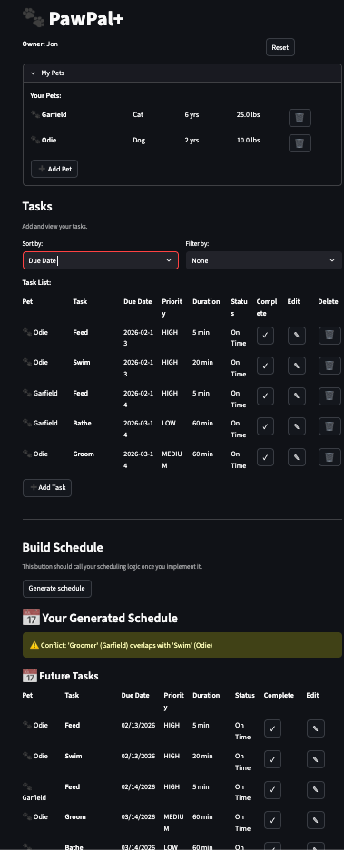

# PawPal+ (Module 2 Project)

You are building **PawPal+**, a Streamlit app that helps a pet owner plan care tasks for their pet.

## Scenario

A busy pet owner needs help staying consistent with pet care. They want an assistant that can:

- Track pet care tasks (walks, feeding, meds, enrichment, grooming, etc.)
- Consider constraints (time available, priority, owner preferences)
- Produce a daily plan and explain why it chose that plan

Your job is to design the system first (UML), then implement the logic in Python, then connect it to the Streamlit UI.

## What you will build

Your final app should:

- Let a user enter basic owner + pet info
- Let a user add/edit tasks (duration + priority at minimum)
- Generate a daily schedule/plan based on constraints and priorities
- Display the plan clearly (and ideally explain the reasoning)
- Include tests for the most important scheduling behaviors

## Features

The PawPal+ scheduler implements intelligent algorithms that go beyond basic task management:

### 🎯 Multi-Level Task Sorting
**Algorithm**: Lexicographic sort by (Priority, Days Until Due, Duration)

The `create_plan()` method sorts tasks using a three-tier hierarchy:
1. **Priority** — High priority tasks (HIGH → MEDIUM → LOW) are scheduled first
2. **Due Date Urgency** — Within each priority level, tasks are sorted by how soon they're due. Overdue tasks surface immediately, followed by today's tasks, then future tasks
3. **Duration** — Tasks with equal priority and due date are ordered by length, with shorter tasks first to maximize completion

This ensures the owner tackles the most critical, time-sensitive, shortest tasks first.

### 📅 Recurring Task Scheduling
**Patterns**: ONCE, DAILY, WEEKLY, BIWEEKLY, MONTHLY

When a recurring task is marked complete:
- The system records `last_completed` timestamp
- Automatically calculates the next due date based on recurrence pattern
- Creates a new task instance with identical properties but updated due date
- New task is added to the pet's task list

The `needs_scheduling()` method checks if a recurring task is ready for a new occurrence by comparing the interval against `last_completed`.

### ⚠️ Appointment Conflict Detection
**Algorithm**: Interval overlap detection on scheduled time slots

The `detect_conflicts()` method:
- Compares all tasks with explicit `start_time` values (ignores flexible tasks)
- For each pair, calculates end times using `start_time + duration`
- Detects overlap: `start1 < end2 AND start2 < end1`
- Returns human-readable warnings identifying conflicting tasks and their pets

This prevents double-booking vet appointments, grooming sessions, or other time-critical care without false positives for flexible tasks like feeding.

### 🚨 Overdue Task Detection
**Method**: `is_overdue()` checks if a task's due date has passed

Automatically flags incomplete tasks where `due_date < today()` to draw attention to missed care routines.

### 💾 Data Persistence
**Format**: JSON serialization with full object reconstruction

The system provides:
- `save_owner_to_json()` — Writes owner, all pets, and all tasks to JSON
- `load_owner_from_json()` — Reconstructs complete object graph from JSON
- Full support for enums (Priority, Recurrence) and datetime objects
- Handles optional fields gracefully (description, start_time, etc.)

All data persists between app sessions.

### 📋 Schedule Explanation
**Method**: `explain_plan()` generates human-readable schedule summaries

Displays the schedule plan with:
- Total task count and total time commitment
- Each task's name, priority level, and duration
- Optional task descriptions for context

### Demo



## Getting started

### Setup

```bash
python -m venv .venv
source .venv/bin/activate  # Windows: .venv\Scripts\activate
pip install -r requirements.txt
```

### Suggested workflow

1. Read the scenario carefully and identify requirements and edge cases.
2. Draft a UML diagram (classes, attributes, methods, relationships).
3. Convert UML into Python class stubs (no logic yet).
4. Implement scheduling logic in small increments.
5. Add tests to verify key behaviors.
6. Connect your logic to the Streamlit UI in `app.py`.
7. Refine UML so it matches what you actually built.

### Testing Pawpwal+
The command to run tests is `python -m pytest`. The tests cover sorting correctness, recurrence logic, conflict detection, and data persistence. Based on the fact that 17/17 tests passed, I have a 5/5 confidence level in Pawpal+.