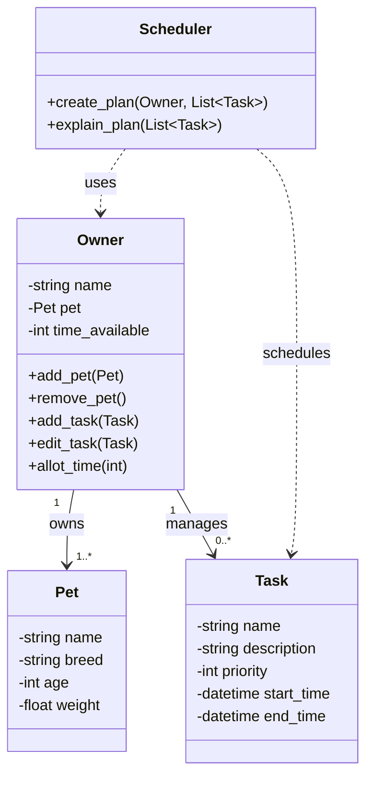

# PawPal+ Class Diagram

## Class Relationships

- **Owner → Pet**: An Owner owns one or more Pets (composition)
- **Owner → Task**: An Owner manages zero or more Tasks (aggregation)
- **Scheduler → Owner**: The Scheduler uses Owner information (dependency)
- **Scheduler → Task**: The Scheduler schedules Tasks (dependency)

## Notes

This diagram represents the initial design based on your brainstorming in reflection.md. You may need to refine this as you implement the logic and discover additional attributes or methods needed for the scheduling functionality.
