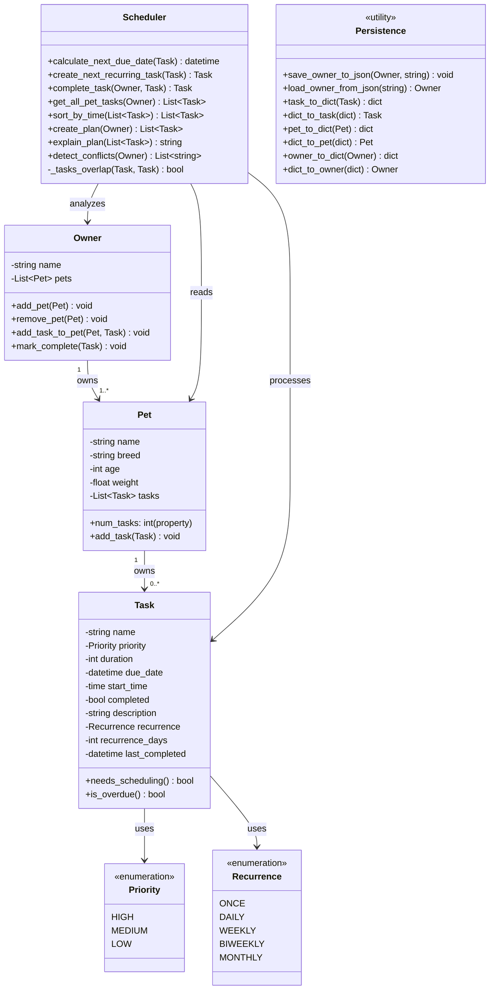

# PawPal+ Class Diagram

## Class Relationships

- **Owner → Pet**: An Owner owns one or more Pets (composition, 1..*)
- **Pet → Task**: A Pet owns zero or more Tasks (composition, 0..*)
- **Task → Priority**: Tasks use Priority enum (HIGH, MEDIUM, LOW)
- **Task → Recurrence**: Tasks use Recurrence enum (ONCE, DAILY, WEEKLY, BIWEEKLY, MONTHLY)
- **Scheduler → Owner/Pet/Task**: The Scheduler analyzes and processes Owner data to create optimized task plans (dependencies)
- **Persistence**: Utility functions for JSON serialization/deserialization of the entire data structure

## Key Implementation Differences from Initial Design

1. **Owner**: Now manages a collection of Pets; tasks belong to Pets, not directly to Owner
2. **Pet**: Now owns a list of Tasks; added `num_tasks` property and `add_task()` method
3. **Task**:
   - Replaced `end_time` with `duration` (in minutes) and `start_time` (optional appointment time)
   - Changed `priority` from int to Priority enum
   - Added recurrence support (pattern + last_completed tracking)
   - Added `is_overdue()` and `needs_scheduling()` methods
4. **Scheduler**: Significantly expanded with methods for:
   - Recurring task management (create_next_recurring_task, complete_task)
   - Task planning and sorting (create_plan with multi-level sorting)
   - Conflict detection for scheduled appointments
   - Conflict detection only checks tasks with explicit start_times
5. **Persistence**: Added JSON serialization for entire system (new in final implementation)
